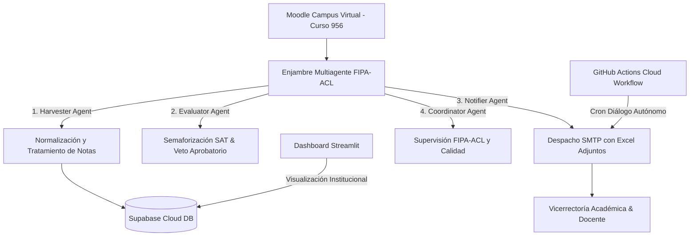

# 🧠 MEMORIA TÉCNICA Y ESTADO DEL PROYECTO SAT-V 2026

**Institución:** Tecnológico del Oriente - Campus Virtual  
**Proyecto:** Sistema de Alertas Tempranas y Permanencia Estudiantil (SAT-V)  
**Curso Objetivo Moodle:** ID 956  
**Docente Principal:** Pedro Elias Noriega Guerrero (`noriegapedro93@tecnologicadeloriente.edu.co`)  
**Fecha de Última Actualización:** 2026-08-06  
**Estado Actual:** 🟢 100% Funcional, Probado y Automatizado en GitHub Cloud.

---

## 1. 📐 Arquitectura General del Sistema

El sistema SAT-V 2026 está compuesto por 4 capas principales:



---

## 2. 🤖 Enjambre Multiagente FIPA-ACL (`agents.py`)

1. **HarvesterAgent (Gemini 1.5 Flash):**
   * Normaliza logs de interacción de Moodle.
   * Aplica reglas de cálculo de promedios evaluados: **inclusión explícita de notas 0.0** y **exclusión estricta de celdas vacías o semanas futuras**.

2. **EvaluatorAgent (Gemini 1.5 Flash):**
   * Evalúa la matriz de riesgo del Manual SAT 2026.
   * Aplica la regla de **Veto Aprobatorio** (Promedio evaluado >= 3.0 en Pregrado o >= 3.5 en Posgrado).

3. **NotifierAgent (Gemini 1.5 Flash):**
   * Genera plantillas dinámicas de correos institucionales según el nivel de riesgo (**ROJO**, **AMARILLO**, **VERDE**).
   * Envía notificaciones por SMTP de forma asíncrona.

4. **CoordinatorAgent (Gemini 1.5 Pro / 3.1):**
   * Orquesta el pipeline multiagente y valida la consistencia lógica antes del almacenamiento y notificación.

---

## 3. 📊 Módulo de Reportes Institucionales (`send_sat_report.py`)

Genera y despacha 2 informes ejecutivos con anexos en Excel:

### 📋 Informe 1: Auditoría, Trazabilidad y Tiempos Docente
* **Destinatarios:** `vice.academica@tecnologicadeloriente.edu.co`, `pedro.noriega@gmail.com`
* **Adjunto:** `Reporte_Trazabilidad_Docente_Curso956.xlsx`
* **Contenido:** Ficha de auditoría del docente Pedro Elias Noriega Guerrero con 9 registros cronológicos de permanencia, 178 minutos acumulados y estado activo en plataforma.

### 📊 Informe 2: Alertas Estudiantiles del Curso
* **Destinatarios:** `noriegapedro93@tecnologicadeloriente.edu.co`, `pedro.noriega@gmail.com`
* **Adjunto:** `Reporte_Alertas_Estudiantiles_Curso956.xlsx`
* **Contenido:** Matriz de semaforización de la cohorte estudiantil del Curso ID 956.

---

## 4. ☁️ Despacho Automatizado 100% Cloud (GitHub Actions)

* **Archivo de Workflow:** `.github/workflows/sat_automated_reports.yml`
* **Repositorio GitHub:** `pedronoriega-eng/sat-moodle-multiagen` (rama `main`)
* **Horario de Disparo Automático:**
  * Programación diaria en GitHub Actions Cloud: **02:00 PM** (Hora Colombia / UTC-5) (`0 19 * * *` UTC).
* **Autonomía:** Se ejecuta completamente en los servidores de GitHub en la nube. **No requiere tener abierto el IDE, ni Antigravity, ni mantener encendido el computador local.**

---

## 5. 🛠️ Credenciales y Configuración de Entorno (`.env`)

* **Servidor SMTP:** `smtp.gmail.com:587` (TLS Activo).
* **Usuario SMTP:** `pedro.noriega@gmail.com`
* **Supabase Cloud URL:** `https://qkpvumvvcxoqdfuzaome.supabase.co`
* **Moodle URL Target:** `https://campusvirtual.tecnologicadeloriente.edu.co` (Curso ID 956).

---

## 6. 📁 Estructura del Código

```text
sat-moodle-service/
├── .github/workflows/
│   └── sat_automated_reports.yml   # Workflow Cloud de GitHub Actions
├── agents.py                       # Enjambre multiagente FIPA-ACL
├── config.py                       # Gestión centralizada de configuraciones y .env
├── dashboard_sat.py                # Dashboard Streamlit con marca institucional
├── database.py                     # Conector Supabase + Fallback SQLite
├── main.py                         # Backend API FastAPI
├── moodle_connector.py             # Integración con Moodle Web Services
├── send_sat_report.py              # Generador y despachador de informes SMTP + Excel
├── logo_oficial.png                # Marca e imagen oficial del Tecnológico del Oriente
├── MEMORIA_PROYECTO_SAT_V.md        # Memoria técnica del proyecto
└── requirements.txt                # Dependencias de Python
```

---

*Memoria generada y archivada automáticamente por Antigravity para el Tecnológico del Oriente.*
