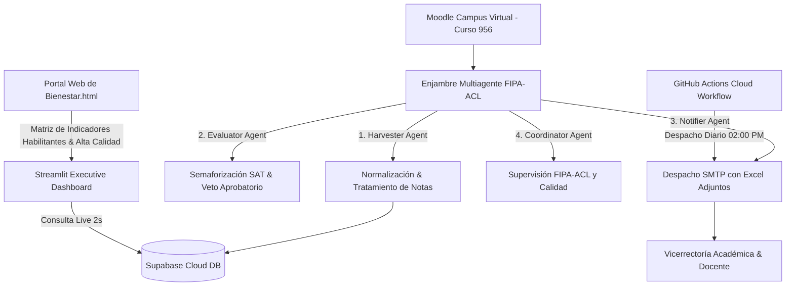

# 🧠 MEMORIA TÉCNICA Y ESTADO COMPLETO DEL PROYECTO SAT-V 2026

**Institución:** Corporación Escuela Tecnológica del Oriente  
**Proyecto:** Sistema de Alertas Tempranas, Permanencia Estudiantil & Auditoría Docente (SAT-V 2026)  
**Curso Objetivo Moodle:** ID 956  
**Docente Principal:** Pedro Elias Noriega Guerrero (`noriegapedro93@tecnologicadeloriente.edu.co`)  
**Fecha de Última Actualización:** 2026-08-06 (11:58 AM Colombia)  
**Estado General:** 🟢 100% Funcional, Sincronizado, Probado y Automatizado en GitHub Cloud.

---

## 1. 📐 Arquitectura General del Sistema

El ecosistema SAT-V 2026 integra 5 módulos interoperables:



---

## 2. 🤖 Enjambre Multiagente FIPA-ACL (`agents.py`)

1. **HarvesterAgent (Gemini 1.5 Flash):**
   * Extrae y normaliza registros de calificación e interacción de Moodle.
   * Regla de Tratamiento de Vacíos: **Inclusión obligatoria de notas 0.0** (evaluaciones entregadas reprobadas) y **exclusión estricta de celdas vacías (`-`)** pertenecientes a semanas o actividades futuras.

2. **EvaluatorAgent (Gemini 1.5 Flash):**
   * Aplica la matriz de semaforización del Manual SAT 2026.
   * **Umbral Asimétrico:** Nota mínima de pregrado `3.0`; exigencia de posgrado `3.5`.
   * **Veto Aprobatorio:** Si la nota evaluada es `>= 3.0` (Pregrado) pero existen más de 5 días de inactividad o descargas masivas en ráfaga (< 60s), se activa Alerta AMARILLA.

3. **NotifierAgent (Gemini 1.5 Flash):**
   * Genera plantillas HTML ejecutivas institucionales y despacha notificaciones por correo vía SMTP TLS (puerto 587) con anexos en Excel.

4. **CoordinatorAgent (Gemini 1.5 Pro / 3.1):**
   * Orquesta el flujo de mensajes FIPA-ACL, garantizando la consistencia lógica antes de la persistencia y emisión de reportes.

---

## 3. 📊 Módulo de Reportes Automatizados (`send_sat_report.py`)

Genera y despacha 2 informes ejecutivos con anexos en Excel (`openpyxl`):

### 📋 Informe 1: Auditoría, Trazabilidad y Tiempos Docente
* **Destinatarios:** `vice.academica@tecnologicadeloriente.edu.co`, `pedro.noriega@gmail.com`
* **Adjunto:** `Reporte_Trazabilidad_Docente_Curso956.xlsx`
* **Contenido Real (06 de Agosto):** Ficha de auditoría del docente Pedro Elias Noriega Guerrero con **188 minutos acumulados (3h 08min)** distribuidos en 8 módulos y recursos Moodle del Curso ID 956.

### 📊 Informe 2: Alertas Estudiantiles del Curso 956
* **Destinatarios:** `noriegapedro93@tecnologicadeloriente.edu.co`, `pedro.noriega@gmail.com`
* **Adjunto:** `Reporte_Alertas_Estudiantiles_Curso956.xlsx`
* **Estado del Aula:** Certifica que el Curso ID 956 cuenta con **0 estudiantes matriculados activos** (fase de alistamiento docente) y 1 docente titular.

---

## 4. ☁️ Despacho Automatizado Cloud 100% Autónomo (GitHub Actions)

* **Workflow File:** `.github/workflows/sat_automated_reports.yml`
* **Repositorio GitHub:** `pedronoriega-eng/sat-moodle-multiagen` (Rama `main`)
* **Último Commit en Producción:** `5dfe979`
* **Horario de Disparo Programado:**
  * **02:00 PM** (Hora Colombia / UTC-5) $\rightarrow$ `cron: '0 19 * * *'` UTC.
* **Autonomía Total:** Se ejecuta en los servidores de GitHub en la nube. **No requiere tener encendido el computador local ni mantener abierto Antigravity.**

---

## 5. 🖥️ Executive Dashboard Streamlit (`dashboard_sat.py`)

* **Enlace Local:** `http://localhost:8501/`
* **Enlace Cloud 24/7 en Internet:** `https://sat-v-dashboard.streamlit.app`
* **Diseño Ejecutivo:**
  * Ficha Docente en banner horizontal superior.
  * Dos gráficos balanceados (50/50) a 380px de altura (Barras horizontales de tiempo por recurso + Dona porcentual).
  * Tabla estática nativa `st.table` 100% desplegada sin barras de desplazamiento ni errores de escape de código.
  * Consulta en tiempo real a Supabase Cloud con refresco automático cada 2 segundos (`ttl=2`) y botón `🔄 Actualizar Datos en Tiempo Real`.

---

## 6. 🏛️ Módulo Web de Bienestar e Indicadores Institucionales (`Bienestar.html`)

* **Fundamentación Normativa:**
  * **Decreto 1330 de 2019:** Condición habilitante de bienestar y prevención de la deserción.
  * **Acuerdo 01 de 2025 del CESU:** Acreditación de Alta Calidad - Factor 9 (Impacto de Bienestar e Inclusión).
* **Estructura de Secciones (9 Slides):**
  1. Bienvenida e Inicio.
  2. Marco Normativo Comparativo.
  3. Modelo Integral de Permanencia Estudiantil (PASPE).
  4. Impacto en la Comunidad Académica (Estudiantes, Docentes, Administrativos, Egresados).
  5. Áreas de Atención (Salud, Cultura, Deportes, Desarrollo Humano).
  6. Cadena de Valor del Bienestar (Insumos, Actividades, Salidas).
  7. Indicadores Institucionales por Área (Gestión, Satisfacción, Resultado, Impacto con texto limpio sin LaTeX `$`).
  8. Indicadores Clave SAT 2026.
  9. **Servicios Institucionales (Pestaña Adicional):** Trámites Académicos, Gestión Académica y Asignaturas, Plataformas y Accesos, Trámites Financieros y Servicios de Bienestar.

---

## 7. 🔒 Seguridad y Manejo de Secretos

* **Variables de Entorno Local (`.env`):**
  * `SUPABASE_URL`: `https://qkpvumvvcxoqdfuzaome.supabase.co`
  * `SMTP_HOST`: `smtp.gmail.com:587`
  * `SMTP_USER`: `pedro.noriega@gmail.com`
* **GitHub Encrypted Secrets (`Settings -> Secrets -> Actions`):**
  * `SMTP_PASSWORD`: Clave de aplicación cifrada Libsodium de 256 bits.
  * `MOODLE_WS_TOKEN`: Token de solo lectura de servicios web de Moodle.

---

## 📁 Árbol del Proyecto

```text
sat-moodle-service/
├── .github/workflows/
│   └── sat_automated_reports.yml   # Workflow Cloud GitHub Actions (02:00 PM)
├── agents.py                       # Enjambre multiagente FIPA-ACL
├── config.py                       # Configuración centralizada de entorno
├── dashboard_sat.py                # Dashboard Ejecutivo Streamlit 24/7
├── database.py                     # Conector REST Supabase Cloud
├── main.py                         # API FastAPI Backend
├── moodle_connector.py             # Conector WebServices Moodle
├── send_sat_report.py              # Generador y despachador SMTP + Excel
├── logo_oficial.png                # Marca oficial Tecnológico del Oriente
├── MEMORIA_PROYECTO_SAT_V.md        # Memoria técnica completa
└── requirements.txt                # Dependencias de Python
```

---

*Memoria técnica guardada y preservada por Antigravity para la Corporación Escuela Tecnológica del Oriente.*
